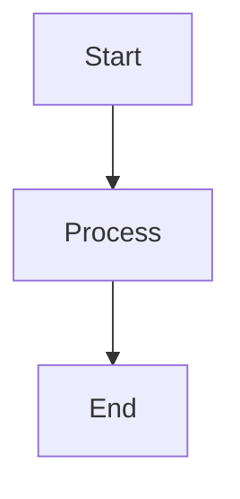
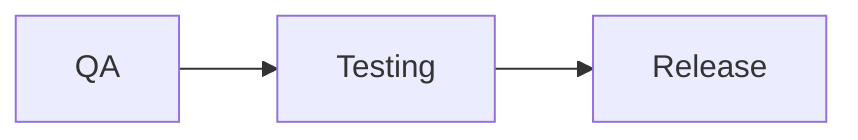
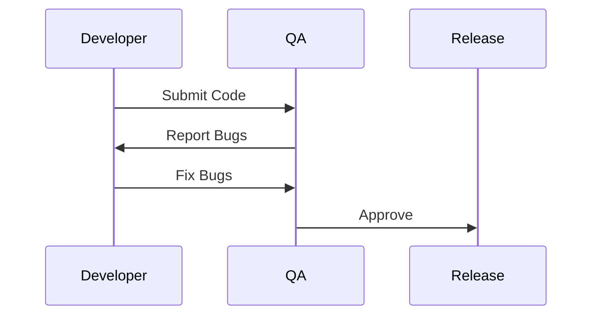
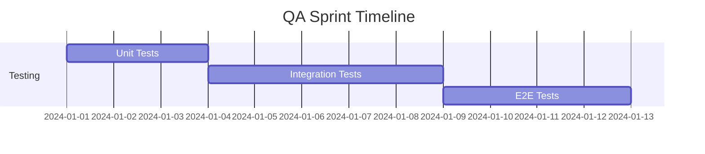
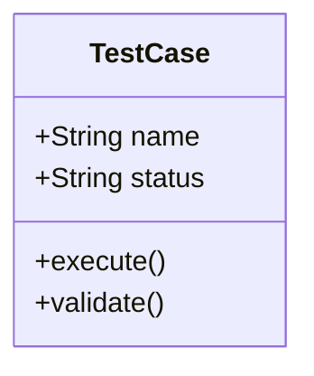
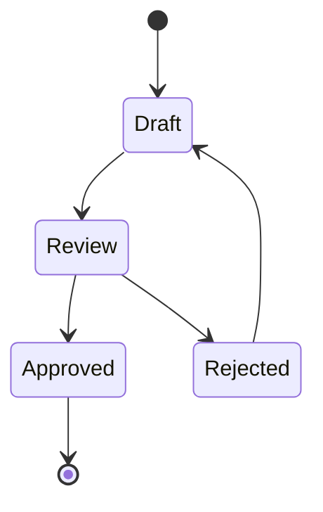
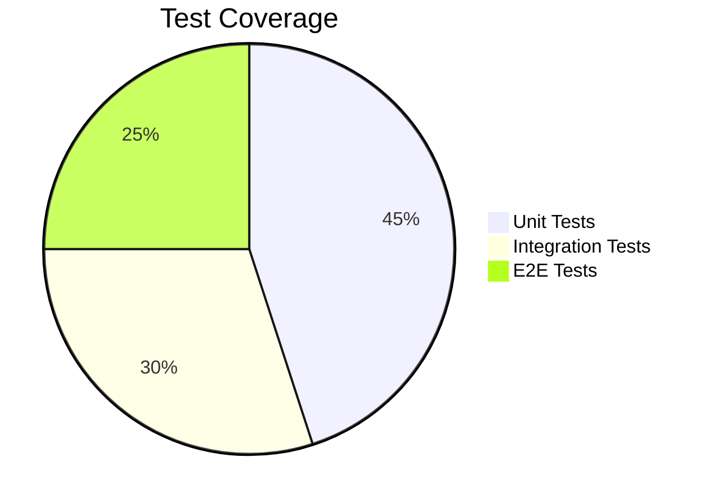
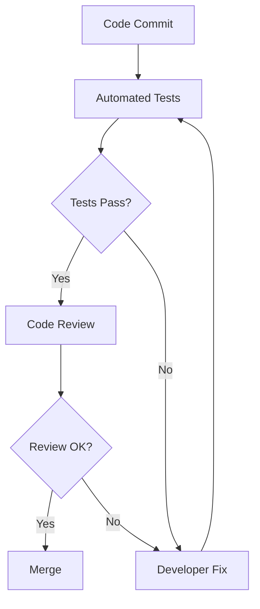

# Mermaid Diagram Usage

Mermaid diagrams are now fully supported in your blog posts. You can create various types of diagrams using simple text-based syntax.

## How to Use

In your markdown blog posts, use code blocks with the `mermaid` language identifier:

````markdown

````

## Supported Diagram Types

### Flowchart


### Sequence Diagram


### Gantt Chart


### Class Diagram


### State Diagram


### Pie Chart


## Example in Blog Post

Here's how you would use a diagram in your blog post:

````markdown
---
title: "Understanding the QA Process Flow"
slug: "qa-process-flow"
excerpt: "A visual guide to modern QA workflows"
author: author1
date: 2024-01-15
tags: [qa-processes, testing]
readTime: 5 min read
---

# Understanding the QA Process Flow

The modern QA process follows a structured workflow:



This diagram shows how code flows through our quality gates...
````

## Styling

Diagrams are automatically styled with:
- Light background (gray-50)
- Padding and rounded corners
- Centered alignment
- Overflow handling for large diagrams

## Resources

For more diagram types and syntax, visit:
- [Mermaid Documentation](https://mermaid.js.org/)
- [Live Editor](https://mermaid.live/)
