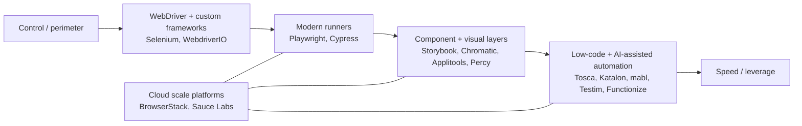

Five-ish years ago, “web test automation” usually meant one thing: Selenium WebDriver, plus a homegrown framework that quietly became a second product. Your value as an automation person was strongly correlated with how well you could engineer that framework, keep it stable, and explain its failures at 02:00.

Today, web automation is no longer a single choice. It’s a spectrum of approaches, and it’s created a real shift in what teams hire for, what “good tests” look like, and what skills are actually scarce.

Not because Selenium is dead (it isn’t). But because the industry stopped treating browser automation as a monolith and started treating it as a toolchain problem.

### The toolchain era: what changed (beyond what’s trendy)

The last five years didn’t deliver one “next Selenium”. They delivered multiple parallel lanes that can coexist in the same organisation:

• Modern E2E frameworks that bias toward fast feedback and strong debugging ergonomics: [Playwright](https://playwright.dev/) and [Cypress](https://www.cypress.io/)

• DevTools-first automation that’s basically “the browser platform talking back”: [Puppeteer](https://pptr.dev/)

• A modernised WebDriver ecosystem (still “classic”, better DX): [WebdriverIO](https://webdriver.io/) and [Nightwatch](https://nightwatchjs.org/)

• “No WebDriver” frameworks that aim to remove setup and timing pain: [TestCafe](https://testcafe.io/)

• Component-first UI workflows that move UI validation earlier: [Storybook](https://storybook.js.org/) plus [Chromatic](https://www.chromatic.com/)

• Visual testing moving from “nice to have” to “automation primitive”: [Applitools](https://applitools.com/)

• Low-code/no-code and AI-assisted platforms that explicitly target maintenance pain: [Tricentis Tosca](https://www.tricentis.com/products/automate-continuous-testing-tosca/model-based-test-automation), [Katalon](https://docs.katalon.com/), [mabl](https://www.mabl.com/low-code-test-automation), [Testim](https://www.testim.io/), [Functionize](https://www.functionize.com/test-maintenance)

Even the protocols are evolving. There’s now a W3C WebDriver BiDi specification at [https://www.w3.org/TR/webdriver-bidi/](https://www.w3.org/TR/webdriver-bidi/), and Selenium documents BiDi support at [https://www.selenium.dev/documentation/webdriver/bidi/](https://www.selenium.dev/documentation/webdriver/bidi/). That’s part of why the “classic” ecosystem is modernising rather than fossilising.

### Selenium didn’t just dominate - it shaped the tester identity

Selenium’s docs capture what made it so foundational: *WebDriver drives a browser natively, as a user would, either locally or on a remote machine using the Selenium server. [Selenium WebDriver documentation](https://www.selenium.dev/documentation/webdriver/)*

That sentence contains the old world in miniature: native browser control, local vs remote grids, and the implied engineering burden of making it reliable at scale.

In the Selenium era, the “automation tester” often looked like a software engineer building a framework:

• Thick abstraction layers (Page Objects, service layers, helpers, wrappers)

• Grid orchestration, driver management, browser version drift, test environment drift

• Parallelisation that exists, but usually isn’t “one flag and done”

• Failure triage driven by logs and screenshots, not rich execution traces

• A mindset that the automation codebase must be engineered like a long-lived system, because it is

None of that is inherently wrong. It’s a rational optimisation for a specific reality: complex estates, long-lived products, compliance constraints, and environments where you cannot “just use a SaaS runner”.

### What modern tools did differently (and why it changed behaviour)

Modern frameworks didn’t just add features. They baked in opinions that changed how teams behave.

**Playwright** treats test authoring and debugging as first-class workflows. It ships with test generation: *Playwright comes with the ability to generate tests… [Playwright codegen](https://playwright.dev/docs/codegen)*

And it treats trace-based debugging as a normal part of failure analysis: *The trace viewer is a tool to explore recorded Playwright traces… [Playwright Trace Viewer](https://playwright.dev/docs/trace-viewer)*

**Cypress** leans hard into interactive debugging and a tight feedback loop: *The Cypress App takes snapshots of your application and enables you to time travel… [Why Cypress](https://docs.cypress.io/app/get-started/why-cypress)*

DevTools-first tools like **Puppeteer** position themselves as APIs over browser debugging protocols: *Puppeteer is a JavaScript library… to control Chrome or Firefox over the DevTools Protocol or WebDriver BiDi. [Puppeteer docs](https://pptr.dev/)*

Some tools explicitly market themselves as removing setup overhead: *No WebDriver required… [TestCafe](https://testcafe.io/)*

The net effect isn’t just “less code”. It’s less framework invention. Which is why the tester identity shifted away from “framework engineer” toward “toolchain pragmatist”.

### Alex and Sam: two mindsets, both rational

The cleanest way to avoid turning this into a religion is to talk about two humans.

#### Alex: the framework engineer (Selenium-native thinking, still relevant)

Alex treats automation as software engineering with long-term architectural concerns. The test suite is a product. It’s designed to survive. It has conventions. It gets versioned. It gets defended.

Alex’s default mode is: control the environment, control the data, control the execution.

Alex’s strengths aren’t just coding. They’re systems skills:

• Building maintainable abstractions (Page Objects and beyond)

• Designing stable selectors and interaction layers that survive UI churn

• Engineering CI execution to be predictable under load

• Making failures diagnosable and auditable

• Handling enterprise constraints (proxy, SAML/SSO, bespoke cert chains, internal networks, air-gapped setups)

This mindset fits regulated environments and sensitive product work where cloud services are forbidden or politically expensive. If you can’t run tests outside the perimeter, you can’t rent scale. You build it.

The trade-off is that Alex can end up owning a framework that needs constant gardening. Framework maintenance becomes a tax. In high-churn UIs, that tax can be brutal. In slower-moving, high-control environments, it can be the right price to pay.

#### Sam: the toolchain pragmatist (modern automation as delivery capability)

Sam treats automation as a delivery capability: fast signals, high leverage, minimum ceremony. The suite doesn’t need to be elegant. It needs to be trustworthy, fast to run, and fast to debug.

Sam’s default mode is: reduce time-to-signal, reduce maintenance, increase visibility.

Sam’s toolkit tends to be layered:

• E2E checks in Playwright or Cypress

• Component isolation for UI behaviour in Storybook

• Visual diffs for the “it still works but looks wrong” category

• Cloud execution for cross-browser/device scale when it’s allowed

• Low-code and AI-assisted tools where they remove toil rather than hide risk

This is where component-first and visual workflows become more than hype.

Storybook positions itself very clearly: *Storybook is a frontend workshop for building UI components and pages in isolation. [Storybook](https://storybook.js.org/)*

Chromatic frames UI testing as something that happens continuously across real browsers: *Chromatic renders every possible state of your UI in a fleet of cloud browsers… [Chromatic UI tests](https://www.chromatic.com/features/test)*

Applitools pushes cross-browser visual coverage into “seconds, not days” territory: *Ultrafast Grid allows you perform visual testing across multiple browsers and devices in seconds… [Applitools Ultrafast Grid](https://applitools.com/docs/eyes/concepts/test-execution/ultrafast-grid)*

Low-code platforms explicitly pitch that automation shouldn’t be gated behind deep programming skills: *Model-based test automation is a codeless approach that literally anyone can learn and use. [Tricentis Tosca model-based test automation](https://www.tricentis.com/products/automate-continuous-testing-tosca/model-based-test-automation)*

Sam’s trade-off is different: tool sprawl and vendor gravity. Six services later, the test stack becomes a procurement problem, a security review problem, and a “who owns this contract” problem. Also, when a tool claims to delete complexity, it usually relocates it. Sometimes that’s fine. Sometimes it’s a trap.

### The skills shift: from “framework engineering” to “adaptability engineering”



It’s tempting to frame this as “code-heavy to no-code”. That’s not quite accurate. What changed is the *bottleneck*.

In the Selenium era, the bottleneck was often “can we build and maintain the framework and infrastructure”. In the toolchain era, the bottleneck is more often “can we design the right signals, at the right layer, with the right cost”.

That’s why so many tools now sell themselves on maintenance reduction rather than authoring.

**Testim**, for example, explicitly markets stability through “smart locators” and self-healing: *Smart locators… automatically self-heal to keep tests working even as applications change. [Testim](https://www.testim.io/)*

F**unctionize** makes the same promise in plain language: *Renaming or restyling a button, even moving it on the page won’t break your tests. [Functionize test maintenance](https://www.functionize.com/test-maintenance)*

**mabl** leans into “agentic testing” language, which is a sign of where vendors want this market to go: *Our agentic tester… complements your team’s human expertise with a digital teammate… [mabl Agentic Testing](https://www.mabl.com/agentic-testing-for-software-development-mabl)*

**Katalon**’s docs still treat record and playback as a first-class entry point: *This tutorial demonstrates how to create a Web UI test case… using Record and Playback. [Katalon Record and Playback tutorial](https://docs.katalon.com/katalon-studio/get-started/sample-projects/webui/webui-create-and-run-web-ui-test-case-using-record-and-playback-in-katalon-studio)*

This is the modern story in one sentence: automation moved from “write a lot of plumbing to drive the browser” to “get stable signals with minimal bespoke machinery”.

### A concrete example: the wait tax got priced into the tools

One of the most practical differences between old and new is how much time you spend fighting timing and state.

A Selenium-flavoured snippet (the kind Alex has written 1,000 times):

```java
WebDriverWait wait = new WebDriverWait(driver, Duration.ofSeconds(10));
WebElement button = wait.until(ExpectedConditions.elementToBeClickable(By.cssSelector("[data-testid='save']")));
button.click();
```

A Playwright-flavoured equivalent (what Sam expects to be the default experience):

```ts
await page.getByTestId("save").click();
```

The point isn’t that modern frameworks never need thought. It’s that they assume the web is asynchronous and absorb a lot of the waiting, retrying, and visibility into the core experience.

### Where Alex beats Sam (and why it’s not nostalgia)

There are scenarios where the old-school approach is still the better engineering decision:

• Regulated industries with strict data-perimeter requirements

• Products with unreleased features that cannot leak into third-party logs, screenshots, or telemetry

• Restricted internet access, corporate proxies, or air-gapped test labs

• Legacy browser support requirements

• Organisations that need full auditability of test execution and tooling changes

This is where Selenium’s “local or remote machine” model remains powerful. [Selenium WebDriver documentation](https://www.selenium.dev/documentation/webdriver/)

### Where Sam beats Alex (and why it’s not just hype)

And there are scenarios where the modern toolchain approach is simply higher leverage:

• High-change web products where UI churn is constant and releases are frequent

• Teams that want quality signals inside PRs, not after merge

• Frontend-heavy orgs where component isolation is a genuine asset

• Products where “it renders wrong” is as damaging as “it throws an error”

• Teams that can use cloud infrastructure to get scale without building a grid

Cloud browser/device access becomes a strategic accelerator. BrowserStack markets: *Instant access to 3000+ browsers and real iOS and Android devices… [BrowserStack](https://www.browserstack.com/)*

### Modern doesn’t mean simpler - it means redistributed complexity

The new world didn’t delete complexity. It redistributed it:

• Less time writing waits and framework glue

• More time deciding where tests belong (component vs E2E vs visual vs lower layers)

• Less effort building grids

• More effort managing vendors, security reviews, and integration seams

• Less “one framework to rule them all”

• More “portfolio management” of quality signals

That’s why adaptability is the real meta-skill now. Not in the fluffy sense. In the engineering sense: reasoning about trade-offs, choosing tools deliberately, and keeping the signal-to-noise ratio sane.

### Hiring and career implications (the bar didn’t drop, it shifted)

If a team hires exclusively for “deep Selenium framework experience”, it can accidentally hire for a world where the primary work is building and defending a framework. If a team hires exclusively for “Playwright/Cypress and vibes”, it can end up with shallow risk thinking and a toolchain nobody truly owns.

The strong profile in 2026 is bilingual:

• Alex-level respect for maintainability, observability, and risk

• Sam-level pragmatism about speed, debugability, and tool leverage

• Enough engineering depth to know when a low-code tool is a gift vs a liability

• Enough product sense to decide what should be automated at all (and what should not)

The evolution of test automation isn’t “code to no-code”. It’s “framework-centric identity to signal-centric identity”. Selenium made many of us framework engineers. Modern toolchains are turning us into quality systems designers.

---

*Disclaimer: The perspectives expressed herein are personal interpretations intended to foster professional dialogue; they do not represent any official stance of current or former employers.*